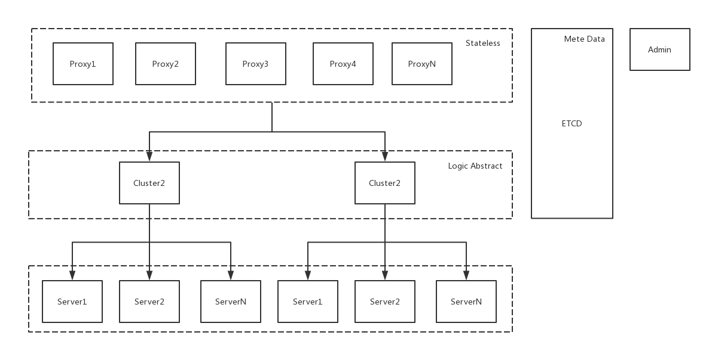

</img>

[](https://gitter.im/fagongzi/gateway?utm_source=badge&utm_medium=badge&utm_campaign=pr-badge)
[](https://travis-ci.org/fagongzi/gateway)
[](https://goreportcard.com/report/github.com/fagongzi/gateway)

Gateway
-------
Gateway 是一个基于HTTP协议的restful的API网关. 

# Features
* 流量控制
* 熔断
* 负载均衡
* 服务发现
* 插件机制
* 基于URL的路由
* API 聚合
* API 参数校验
* API 访问控制（黑白名单）
* API Mock
* 后端server的健康检查
* 使用 [fasthttp](https://github.com/valyala/fasthttp)
* 后台管理UI

# Install
Gateway 依赖 [etcd](https://github.com/coreos/etcd)

## 从源码编译
必须使用go1.8以上版本，由于使用了go1.8的plugin机制

```
git clone https://github.com/fagongzi.git
cd $GOPATH/src/github.com/fagongzi/gateway
go build cmd/proxy/proxy.go
go build cmd/admin/admin.go
```

## 下载二进制文件
[linux-64bit](http://7xtbpp.com1.z0.glb.clouddn.com/gateway-linux64.tar.gz)

## Docker
使用 `docker pull fagongzi/gateway` 命令下载Docker镜像, 使用 `docker run -d fagongzi/gateway` 运行镜像. 镜像启动后export 3个端口:

* 80

  Proxy的http端口，这个端口就是直接为终端用户服务的

* 8081

  Proxy的管理端口，对外提供管理API

* 8080
  
  WEB UI的管理端口

点击 [这里](./build.md) 了解更多的构建和运行的信息.

# Online Demo

* admin

  http://demo-admin.fagongzi.win admin/admin

* proxy
  
  http://demo-proxy.fagongzi.win 

# 架构


## 组件
Gateway由proxy, admin和etcd这三个组件组成

### Proxy
Proxy是Gateway对终端用户提供服务的组件，Proxy是一个无状态的节点，可以部署多个来支撑更大的流量

### Admin 
Admin是一个WEBUI的管理组件，它同样是无状态的节点，一个Admin节点管理一组连接到同一个Etcd，同一个Path下的Proxy

### Etcd
Etcd用来存储Gateway的元数据，例如集群信息、后端服务信息、API信息等

## Gateway中的概念

* Server

  Server是一个真实的后端服务，由IP+PORT作为唯一标示。Server是Gateway中最基本的单元。点击[这里](./server.md)了解更多。

* Cluster

  Cluster是一个逻辑概念，它由一组提供相同服务的Server组成。会依据负载均衡策略选择一个可用的Server。点击[这里](./cluster.md)了解更多。

* API

  API是Gateway的核心概念，我们可以在Gateway的中维护对外的API，以及API的分发规则，路由策略，聚合规则以及URL匹配规则。点击[这里](./api.md)了解更多。

* Routing

  Routing是一个路由策略，根据HTTP Request中的cookie，query string、header中的一些信息把流量分发到指定的Cluster，通过这个功能，我们可以实现AB Test。
  
# Gateway能帮助你做什么
## API 定义
你可以在Gateway中动态的定义API，这些API可以对应后端服务的一个真实的API或者一组真实的API。并且可以随时上线和下线这些API。

## Validation
你可以为每一个API设置一组校验规则，这些校验规则可以动态的修改，并且实时生效。

## API Mock
你可以完全Mock一个后端不存在的API或者为一个API作为发生错误的返回默认值，定义返回的JSON数据以及Header、Cookie等信息。使用这个功能可以用来作为后端服务错误（被流控，被降级等）的时候的默认返回值；也可以帮助前端开发人员在开发阶段独立完成功能。

## 保护后端服务
Gateway 通过 **流控** and **熔断** 的功能保护后端服务。

## AB Test
Gateway 通过 **Routing** 功能可以做AB测试。

# 插件机制
Gateway以go1.8的plugin机制提供如下的扩展点

* filter
  使用go1.8的plugin的机制，编写自定义插件，扩展gateway功能。[如何编写自定义filter](./plugin-filter.md)

